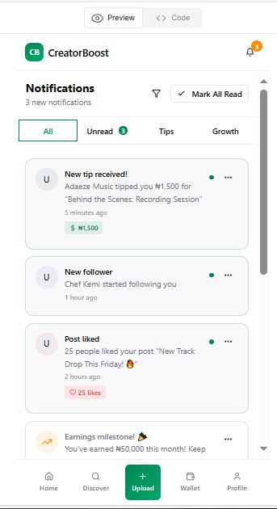

# Product_Manager
IT Product Manager and Project management with a blend of strategic product thinking, technical depth, and cross-functional team excellence delivery.

About Me

I am a Product Manager with a strong background in IT systems, cloud platforms, enterprise software, and digital transformation. My experience spans over a decade leading system rollouts, managing technical integrations, collaborating with engineering and business teams, and delivering high-impact solutions in enterprise environments.

Trained at Betechified Academy, with AIPMM Certified Product Manager (In View — Q1 2026), I specialize in transforming operational problems into scalable digital products — especially across IT solutions, B2B platforms, and fintech ecosystems.

📂 Featured Product Case Studies

CreatorBoost – Digital Monetization & Growth Platform for African Content Creators (Capstone Project)

Product Type: Mobile App + Creator Dashboard
Status: Concept → Research → MVP Definition (2024)
Industry: Creator Economy / Fintech / Social Commerce

🔹 Problem

African content creators face limited revenue options, low platform visibility, and lack of local monetization tools.

🔹 Target Users

Instagram, TikTok, YouTube creators

Influencers (nano → macro)

Freelance creatives (photographers, influencers, entertainment creators)

🔹 Key Insights from Research

65% of Nigerian creators rely on brand deals alone

Many lack analytics tools tailored to local trends

No unified platform that combines monetization + growth + financial tools

🔹 Solution

CreatorBoost — an app helping African creators increase earnings, visibility, and brand readiness, featuring:

AI-powered content enhancement suggestions

Brand partnership marketplace

In-app revenue tools (tips, paid collabs, micro-subscriptions)

Localized analytics (Nigerian + African trends)

**CreatorBoost Project Screenshots:**

| Project                      | Skills                                   | Tools               | Link                     |
|-------------------------------|------------------------------------------|----------------------|---------------------------|
| Wireshark Traffic Analysis    | Network Forensics, Malware Analysis, IOC Identification | Wireshark, OSINT       | [Project 1 Link](./assets/Project_1_Wireshark_Traffic_Analysis_README.md)        |

Automated rate card generator

Integrated wallet for payouts

🔹 My Role (Product Manager)

Conducted discovery, competitive analysis, and user interviews

Defined product vision, value proposition, and feature prioritization

Developed PRD, user journeys, and wireframe concepts

Worked with engineering & design teams on MVP scope

Created GTM strategy for initial launch targeting Lagos, Accra & Nairobi

🔹 Impact (Projected MVP Outcomes)

40% increase in creator income via diversified streams

25% faster brand–creator matching

Increased visibility for creators in emerging markets

Cloud-Based PMS Rollout & Digital Modernization Program

Product Category: Enterprise SaaS / Property Management Systems
Industry: Hospitality Tech

🔹 Problem

Legacy PMS and financial tools caused operational downtime, data fragmentation, and inability to support global parent company standards.

🔹 Product Outcome

Deployment of a cloud-based PMS suite aligned with global standards, enabling:

Real-time analytics

Seamless finance + revenue integrations

Scalable architecture for multi-property operations

🔹 My Role (as Product Manager-in-Function)

Defined requirements based on user interviews with finance, revenue, and operations teams

Prioritized features with engineering and vendor teams

Coordinated sprint cycles for phased deployment

Aligned stakeholders and secured CAPEX funding

Led UAT, change management, and post-launch optimization

🔹 Measurable Impact

30% infrastructure cost reduction

20% improvement in operations workflow speed

Increased data reliability and centralized reporting

3️⃣ Multi-System Integration: Opera PMS + Revenue Management + Finance Suite

Product Category: System Integration / Workflow Automation
Industry: Hospitality / Enterprise IT

🔹 Problem

Key enterprise systems were siloed, preventing accurate forecasting, reporting, and revenue optimization.

🔹 Solution

Coordination and rollout of a harmonized integration between:

Opera PMS

Revenue Management System

Finance + Accounting Tools

Central Reservation System (CRS)

🔹 My Role (Product-Lens Leadership)

Developed integration requirements and success metrics

Facilitated cross-functional alignment between finance, revenue, and IT

Managed vendor engagement and API integration priorities

Validated workflows and coordinated feature testing

🔹 Impact

Improved forecasting accuracy

Reduced manual reconciliation time by 40%

Enhanced end-to-end guest lifecycle tracking

4️⃣ Internal CRM Enhancement for Multi-Property User Experience

Product Category: CRM Optimization / B2B Platform
Industry: Hospitality / Enterprise SaaS

🔹 Problem

CRM lacked unified behavior tracking across properties, limiting marketing personalization and service quality.

🔹 Solution

A redesigned CRM workflow integrated customer data streams, aligned across business units.

🔹 My Role

Conducted interviews with marketing & operations teams

Defined feature backlog using RICE prioritization

Produced UX process maps and workflow improvements

Coordinated with developers to ensure API readiness

Built dashboards that enabled marketing segmentation

🔹 Impact

18% improvement in repeat customer retention

Centralized user data across properties

Automated segmentation features that saved 10+ work hours weekly

5️⃣ IT Modernization Roadmap (3-Year Product Strategy)

Product Category: Product Strategy / Digital Transformation
Industry: Enterprise IT

🔹 Objective

To standardize, unify, and modernize the digital landscape of the business, making it compatible with global parent company architecture.

🔹 My Role

Defined product vision and transformation objectives

Created a roadmap covering infrastructure, applications, and cloud adoption

Prioritized initiatives based on ROI and user impact

Established performance KPIs

Led executive presentations and decision-making workshops

🔹 Impact

Clear 36-month modernization plan

Alignment of IT capabilities with global standards

Budget approval for tech transformation projects

🧰 Tools & Skills Applied Across All Projects
Product Skills

Product Roadmapping

PRD Writing

User Research (Interviews + Surveys)

Competitive Analysis

Feature Prioritization (RICE, MoSCoW)

Agile Delivery / Scrum

Data-Driven Decision Making

Wireframing (Figma / Miro)

GTM Strategy & Launch Planning

Technical Skills

Cloud SaaS Solutions

PMS, CRS, RMS integrations

API Workflow Mapping

CRM Optimization

SQL Basics

Data Visualization (Power BI)

Tools

JIRA • Trello • Confluence • Notion • Figma • Miro • Power BI • SQL • HubSpot • Salesforce • Azure • ServiceNow
